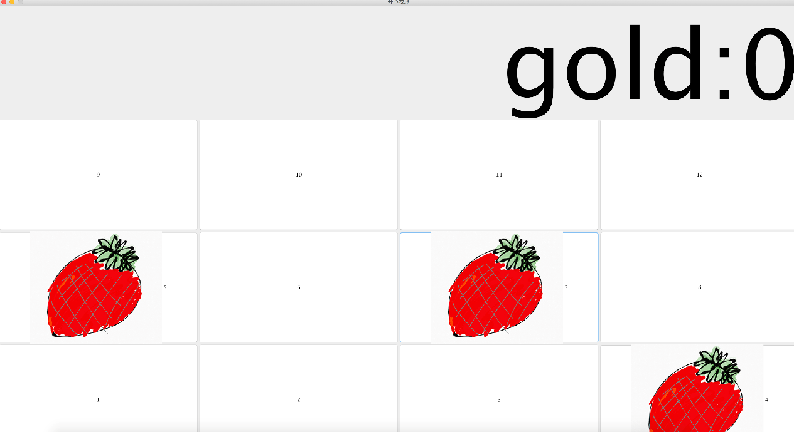
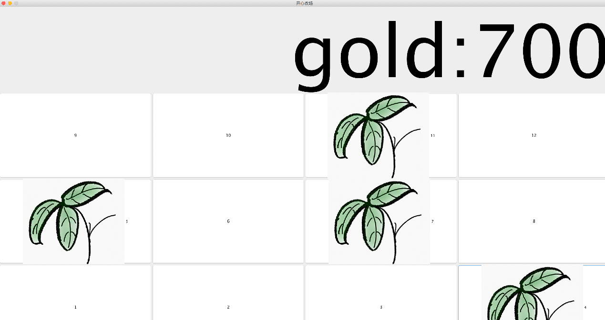
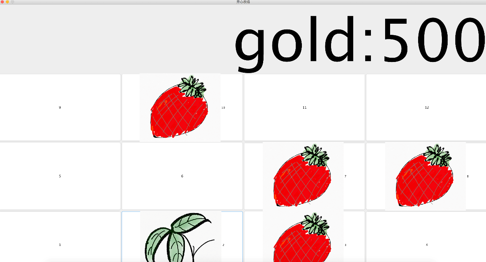

# happy-farm

## 前言
### 这是我读大学做的第二个课程设计
JAVA大作业  
开心农场  
完成于
### 2018.10.18

## 目录
* [前言](#前言)
* [概述](#概述)
    * [开发环境](#开发环境)
    * [基本原理或技术](#基本原理或技术)
    * [系统需求](#系统需求)
    * [实现功能](#实现功能)
        * [基本功能](#基本功能)
        * [扩展功能](#扩展功能)
        * [未实现功能](#未实现功能)
* [程序概要设计](#程序概要设计)
    * [流程简述](#流程简述)
* [程序详细设计](#程序详细设计)
    * [引入库](#引入库)
    * [Score类](#Score类)
    * [Vegetable类](#Vegetable类)
    * [MyFarme类](#MyFarme类)
* [总结](#总结)
    * [优点](#优点)
    * [不足](#不足)
    * [困难](#困难)
    * [收获](#收获)
    * [结语](#结语)
* [参考文献](#参考文献)
* [软件截图](#软件截图)

## 概述

### 开发环境

* os：Mac OS Sierra 10.12.6  
- jdk：9.0
* IDE：IntelliJ IDEA Community 2017.3 

### 基本原理或技术

### 系统需求

### 实现功能

#### 基本功能

* 能同时种很多棵菜（多线程）
- 能计算收益
* DIY用Sketches和apple pencil画了所有农产品素材

#### 扩展功能

* 有彩蛋

#### 未实现功能

* 不能计算成本
- 钱仅仅会增加而且不会减少

## 程序概要设计

### 流程简述

程序界面就是12个按钮和1一个显示当前情况的标签，12个按钮都有一个监听器。
监听器当被点击的时候，会生成一个新进程，这个进程用来控制菜的情况。
最后修改金币。通过标签显示在程序界面。

## 程序详细设计

### 引入库

### Score类

    public class Score {                                   
      int experience;                                    //用一个整形来存储当前经验值
      int gold;                                          // 用一个整形来存储当前获得的金币  
      public Score(){                                    //初始化经验和金币为0
        experience=0; 
        gold=0;    
      }   
      public void add(int addExperience,int addGold){    //每种一棵菜收获后要调用的类方法
        experience=experience+addExperience;             //增加金币和经验
        gold=gold+addGold;  
      }    
      public String toString() {                          //返回一个字符串到主函数最后输出          
        return "gold:"+gold;                              //到程序界面  
      }
    }
    
这是一个用来记录当前获得经验和当前金币的类，本来想设计成静态类的，但是由于我的水平不够所以设计成普通类，这样的话对于程序来讲，会造成内存上的一些浪费，类的访问速度也会下降。

### Vegetable类

    public class Vegetable implements Runnable {                            // 作为一个线程需要实现Runnable
      JButton myButton;                                                     // 仅仅是一个引用，修改传经来的JButton变量的图标用来表示菜的不同成长阶段
      Score myScore;                               
      JLabel myLabel;  
      public vegetable(JButton newButton,Score newScore,JLabel newLabel){   //初始化各变量
        myButton=newButton;                     
        myScore=newScore;
        myLabel=newLabel;    
      }    
      public void run() {
        myButton.setIcon(new ImageIcon("/Users/arterialdm/Downloads/修改2.jpg"));
        try {
          Thread.sleep(5000);                                               //线程暂停一段时间等菜成熟
        }catch (InterruptedException e){
          System.out.println(e.toString());
        }     
        myButton.setIcon(new ImageIcon("/Users/arterialdm/Downloads/修改3.jpg"));
        try {                                                               //菜进入第二个阶段，换一张图片
          Thread.sleep(5000);
        }catch (InterruptedException e){
          System.out.println(e.toString());      
        }        
        myButton.setIcon(new ImageIcon("/Users/arterialdm/Downloads/修改1.jpg"));
        try {                                                               //又换一张            
          Thread.sleep(5000);
        }catch (InterruptedException e){
          System.out.println(e.toString());
        }
        myButton.setIcon(new ImageIcon("/Users/arterialdm/Downloads/修改4.jpg"));
        myScore.add(30,100);                                                //最后一步增加30经验和100金币
        myLabel.setText(myScore.toString());                                //更换主程序的标签显示
      }
    }

这是一个多线程要执行的代码，每一棵菜都是一个进程，每新种下去一棵菜，主函数都会新创建一个进程里控制这棵菜的生长情况，并且最后修改金币和经验值。

### MyActionListener类

    public class MyActionListener implements ActionListener {
      JButton mybutton;                                                            //用来存储被监听按钮的引用
      Score myScore;                                                               //用来存储记分类的引用   
      JLabel myLabel;                                                              //用来存储界面所显示的标签的引用
      public MyActionListener(JButton newButton,Score newScore,JLabel newLabel){   //初始化各变量
        mybutton=newButton;             
        myScore=newScore;
        myLabel=newLabel;
      }
      public void actionPerformed(ActionEvent e) {                                  //按钮被点击后要执行的代码
      Thread myThread= new Thread(new vegetable(mybutton,myScore,myLabel));
      myThread.start();                                                             //创建一个线程并开始
      }
    }
    
这是一个监听器类，用来监听每一块能种菜的土地上面是否有被鼠标点击，被鼠标点击后会创建一个新的线程来处理种菜事件。

### MyFarme类

    public class MyFarme extends JFrame  {
      static myFarme mainJFrame=new myFarme();
      static JLabel show=new JLabel();
      public static void main(String[] args){
        Score myScore=new Score();                                           //创建一个myScore来存储经验和金币
        mainJFrame.setTitle("开心农场");
        mainJFrame.setLocationRelativeTo(null);
        mainJFrame.setSize(1920,1080);
        mainJFrame.setDefaultCloseOperation(JFrame.EXIT_ON_CLOSE);
        mainJFrame.setResizable(false);
        Container container=mainJFrame.getContentPane();
        JPanel pn1=new JPanel(new FlowLayout(FlowLayout.CENTER,-30,0));
        pn1.setLayout(null);
        pn1.setBackground(null);
        pn1.setOpaque(false);
        pn1.setLocation(50,170);
        pn1.setSize(232,235);
        JButton btn1=new JButton("1");                                       //创建了一些按钮
        JButton btn2=new JButton("2");
        JButton btn3=new JButton("3");
        JButton btn4=new JButton("5");
        JButton btn5=new JButton("6");
        JButton btn6=new JButton("7");
        JButton btn7=new JButton("9");
        JButton btn8=new JButton("10");
        JButton btn9=new JButton("11");
        JButton btnX=new JButton("12");
        JButton btnAdd=new JButton("4");
        JButton buttonMinus=new JButton("8");
        btn1.addActionListener(new MyActionListener(btn1,myScore,show));     //每个按钮都上
        btn2.addActionListener(new MyActionListener(btn2,myScore,show));     //监听器
        btn3.addActionListener(new MyActionListener(btn3,myScore,show));
        btn4.addActionListener(new MyActionListener(btn4,myScore,show));
        btn5.addActionListener(new MyActionListener(btn5,myScore,show));
        btn6.addActionListener(new MyActionListener(btn6,myScore,show));
        btn7.addActionListener(new MyActionListener(btn7,myScore,show));
        btn8.addActionListener(new MyActionListener(btn8,myScore,show));
        btn9.addActionListener(new MyActionListener(btn9,myScore,show));
        btnX.addActionListener(new MyActionListener(btnX,myScore,show));
        btnAdd.addActionListener(new MyActionListener(btnAdd,myScore,show));
        buttonMinus.addActionListener(new MyActionListener(buttonMinus,myScore,show));
        show.setBounds(0,0,1920,270);
        show.setHorizontalAlignment(SwingConstants.RIGHT);
        show.setText(myScore.toString());
        show.setFont(new Font("Serief",Font.PLAIN,230));                      //显示标签设字体
        btn8.setSize(80,80);                                                  //按钮设坐标
        btnX.setSize(80,80);
        btnAdd.setSize(480,270);    
        btnAdd.setLocation(1440,810);
        buttonMinus.setSize(480,270);     
        buttonMinus.setLocation(1440,540);
        btnX.setSize(480,270);     
        btnX.setLocation(1440,270);
        btn3.setSize(480,270);     
        btn3.setLocation(960,810);
        btn6.setSize(480,270);         
        btn6.setLocation(960,540);
        btn9.setSize(480,270);          
        btn9.setLocation(960,270);
        btn2.setSize(480,270);         
        btn2.setLocation(480,810);
        btn5.setSize(480,270);         
        btn5.setLocation(480,540);
        btn8.setSize(480,270);         
        btn8.setLocation(480,270);
        btn1.setSize(480,270);          
        btn1.setLocation(0,810);
        btn4.setSize(480,270);          
        btn4.setLocation(0,540);
        btn7.setSize(480,270);      
        btn7.setLocation(0,270);
        pn1.add(show);                                                         //按钮加入面板
        pn1.add(btnX);
        pn1.add(buttonMinus);
        pn1.add(btnAdd);
        pn1.add(btn1);
        pn1.add(btn2);
        pn1.add(btn3);
        pn1.add(btn4);
        pn1.add(btn5);
        pn1.add(btn6);
        pn1.add(btn7);
        pn1.add(btn8);
        pn1.add(btn9);
        pn1.add(btnX);
        container.add(pn1);
        mainJFrame.setVisible(true);                                           //主框架可见
        }
      }

## 总结

### 优点

* 运用了课堂上没有教授的多线程技术

### 不足

* 多线程技术不成熟
- 游戏最终运行起来有一个刷钱和刷金币的漏洞

### 困难

一开始我想用一个二维数组来存储每块田的使用情况，然后发现达不到我想要的效果，在CSDN上看见了一个开发马里奥游戏的java代码，里面有一段碰撞检测的代码使用了多线程，我觉得我的游戏就是需要这个效果，然后看了一下资料，然后试了几遍，就行了，不过具体原理还不是太会。

### 收获

* 会了一点点多线程
- 对JAVA熟练了一点

### 结语

### 这份简简单单的Java作业是我第一次尝试从代码设计到素材绘画全由自己一个人完成
  
现在时间是
### 2020.2.14  
### 情人节
 
## 参考文献

* CSDN

## 软件截图

种了三块地，三块地都已经到收获期了，金币还没下一步就会增加了。

金币已经累计到700了，又种了4棵苗。

金币累计到500，有些地已经有果实，其他的还处于苗阶段。
